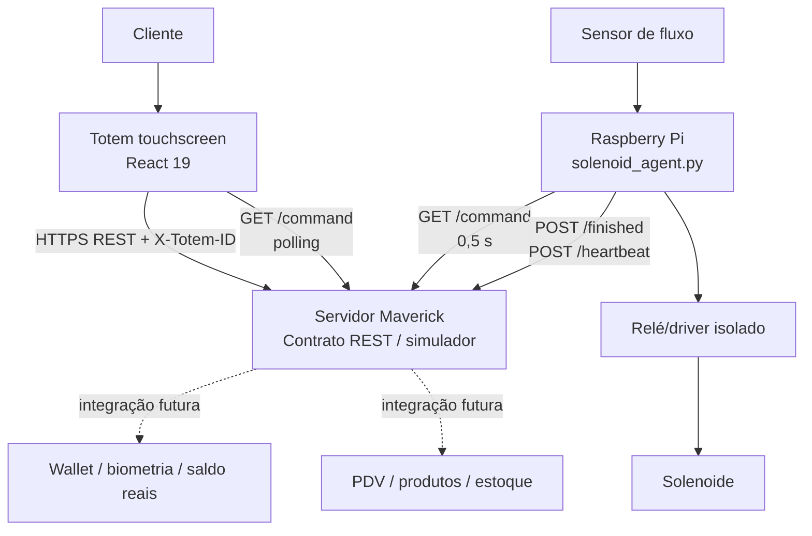
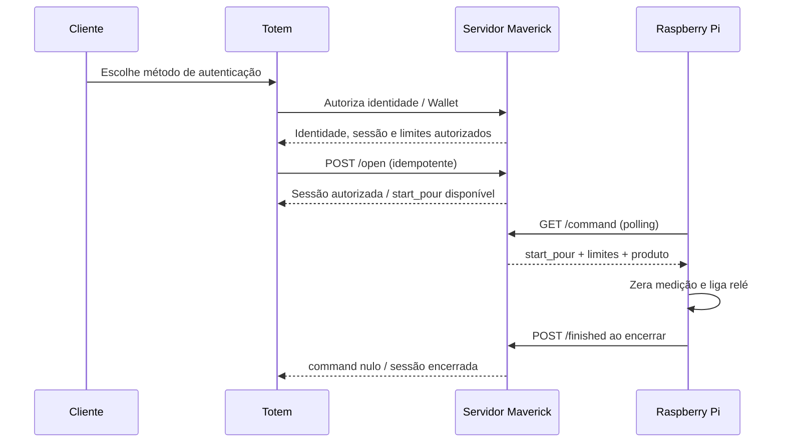

# Totem Maverick Smart — Documentação Técnica Consolidada

**Versão do projeto:** 1.0.0  
**Escopo documentado:** implementação atual do totem, simulador REST, agente Raspberry Pi, interface touchscreen e testes.  
**Status:** base de desenvolvimento e homologação. O simulador e as credenciais de teste não devem ser usados em produção.

## 1. Objetivo e escopo

O **Totem Maverick Smart** é uma aplicação de autoatendimento para dispensação controlada de chope. A solução combina uma interface React para display vertical de 7 polegadas, um contrato REST para autorização e ciclo de dispensação e um agente Python para Raspberry Pi que comanda a solenoide e mede o fluxo físico.

O projeto separa responsabilidades operacionais: o totem apresenta os fluxos e solicita autorizações; o servidor central deve ser a fonte de verdade para Wallet, identidade, saldo, regras comerciais e auditoria; e o Raspberry Pi executa o controle físico fail-safe. A implementação atual contém um **simulador REST local** que permite validar esse contrato de ponta a ponta antes da integração com serviços reais.[1] [2]

> **Importante:** não há, nesta versão, motor biométrico real, integração de adquirência de cartão, Wallet produtiva, estoque real ou acionamento GPIO pelo servidor web. Esses itens precisam ser integrados e homologados antes de operação comercial.[2] [3]

## 2. Arquitetura implementada



| Camada | Tecnologia atual | Responsabilidade | Estado de produção |
|---|---|---|---|
| Interface de totem | React 19, TypeScript, Vite, Tailwind CSS 4 | UX touchscreen, QR, Face ID, senha, cartão, sessão e feedback | Implementada; dados de produto e PDV ainda são fixos |
| Cliente REST | `client/src/lib/tapApi.ts` | Headers, idempotência, retry, fila de `finished` | Implementado para navegador |
| Regras de autorização | `client/src/lib/totemAuthorization.ts` | Validação de resposta, limites e transições | Implementado |
| Servidor de contrato | Express 4 em `server/tapApi.ts` | Simulação de autorização, sessão, comando, encerramento e E-stop | Simulador para desenvolvimento/homologação |
| Controle físico | Python 3, `gpiozero` | Relé, sensor de fluxo, limites e fail-safe | Implementado; requer instalação e calibração em bancada |
| Persistência de operação | `localStorage` no navegador e arquivo JSON no Pi | Reenvio de encerramentos pendentes | Implementado como resiliência local |
| Banco e autenticação do template | Drizzle/MySQL, OAuth/tRPC | Infraestrutura fornecida pelo template | Não é a fonte de verdade de vendas nesta versão |

O servidor Express e a aplicação React fazem parte do template full-stack do projeto. Os comandos disponíveis incluem `pnpm dev`, `pnpm build`, `pnpm start`, `pnpm check` e `pnpm test`.[4]

## 3. Organização do repositório

| Caminho | Conteúdo principal |
|---|---|
| `client/src/pages/Home.tsx` | Máquina de estados efetiva da interface e componentes de tela |
| `client/src/index.css` | Layout e estilo do kiosk de 7 polegadas |
| `client/src/lib/tapApi.ts` | Cliente REST, retry e fila de finalizações pendentes |
| `client/src/lib/totemAuthorization.ts` | Reconhecimento facial, validação de limites e autorização de sessão |
| `server/tapApi.ts` | Simulador REST e regras de idempotência/sessão |
| `shared/totem.ts` | IDs do totem/torneira, produto, utilitários de valor e nonce |
| `raspberry_pi/solenoid_agent.py` | Agente de GPIO, medição, fail-safe e fila local |
| `raspberry_pi/maverick-solenoid.service` | Unidade `systemd` do agente físico |
| `raspberry_pi/solenoid.env.example` | Variáveis de ambiente do Raspberry Pi |
| `docs/` | Contrato REST, segurança física, validações e esta documentação |
| `server/*.test.ts` e `client/**/*.test.ts` | Cobertura de contrato, segurança, interface e fluxos |

## 4. Interface touchscreen de 7 polegadas

A interface foi reconstruída para o layout vertical compacto de referência. O estágio do kiosk reúne cabeçalho com conectividade, informações do produto, preço/litro, preço/100 ml, ABV, IBU, PDV, QR Code rotativo e ações de Face ID e cartão.[1]

### 4.1 Telas e estados efetivamente ativos

| Estado | Tela | Finalidade | Saídas relevantes |
|---|---|---|---|
| `idle` | Tela inicial | Exibe produto, QR Code com nonce e métodos de compra | Face ID, cartão, QR, `start_pour` do servidor |
| `face` | Captura facial | Solicita reconhecimento facial | Senha, reset, offline |
| `face-password` | Senha da Wallet | Solicita PIN após reconhecimento aprovado | Dispensação, mantém senha em falha, offline |
| `card` | Cadastro de cartão | Coleta nome, CPF e data de nascimento | Solicitação de sessão ou cancelamento |
| `pouring` | **Servindo seu chopp** | Exibe sessão, volume, total e limite autorizado | Conclusão, E-stop, offline |
| `completed` | Sessão encerrada | Mostra volume e valor finais | Retorno automático ao início após 4 s |
| `offline` | Sem conexão | Bloqueia a operação enquanto não há comunicação | Retorno ao início após reconexão |
| `error` | Sessão interrompida | Informa bloqueio por segurança | Reset manual |

A antiga tela intermediária de confirmação do totem foi removida. A decisão de autorização pertence ao servidor/Wallet; o totem recebe a autorização e segue para a dispensação conforme o fluxo aplicável.[1] [5]

### 4.2 Ergonomia e acessibilidade

Os controles interativos usam alvo mínimo de toque de 48 pixels e a ação principal de Face ID utiliza alvo circular maior. A interface trata conectividade com o indicador de Wi‑Fi no cabeçalho e reage aos eventos `online`/`offline` do navegador. O QR Code é renovado a cada 30 segundos por meio de um nonce novo.[1]

### 4.3 Produto e parâmetros apresentados

No estado atual, a interface mostra **Heineken Lager**, PDV **Toca do Tatu - Moema**, preço de **R$ 3,49 por 100 ml**, ABV de **5,0%** e IBU de **5,5**. Esses dados são constantes no frontend para fins de demonstração e devem ser substituídos por dados autenticados do servidor/PDV.[1]

## 5. Fluxos de autorização e dispensação

### 5.1 Regra central de liberação

Nenhum fluxo deve energizar a válvula por ação local isolada. A abertura é solicitada ao servidor com sessão, produto e limites válidos. O comando retornado pelo servidor é `start_pour`; o Pi só aciona o relé quando recebe esse comando.[2] [3]



### 5.2 QR Code da Wallet

O QR Code contém URI com `tap`, `totem`, `nonce` e timestamp. A ação de desenvolvimento simula sua leitura; o servidor verifica estrutura, nonce com ao menos 12 caracteres e janela de até 120 segundos. Em produção, a Wallet deve assinar o payload e o servidor deve validar assinatura, sessão e uso único do nonce.[1] [2]

Após uma autorização QR bem-sucedida, o totem solicita `POST /open`, reseta a tela para `idle` e aguarda o `start_pour` disponibilizado pelo servidor via polling. Essa arquitetura permite que a autorização também seja iniciada fora do totem, como no aplicativo Wallet.[1] [5]

### 5.3 Face ID e senha da Wallet

O Face ID implementado é composto por duas fases explícitas:

1. O totem envia a captura facial e o nonce com `phase: "recognize"`.
2. Se o servidor retornar `recognized: true`, `face_token` e `user_id`, o totem apresenta a tela de senha.
3. O usuário informa o PIN. O totem envia `phase: "authorize"`, PIN, token facial, nonce e timestamp.
4. A resposta só é considerada válida quando contém `authorized: true`, `session_id`, `user_id`, `max_value_cents` e `max_volume_ml` positivos e finitos.
5. O totem chama `POST /open` com os limites retornados e entra diretamente em **Servindo seu chopp**, mostrando a sessão oficial do servidor.[1] [5]

Se a senha não for aprovada, a tela de senha permanece aberta com mensagem de erro, sem retorno ao IDLE. Se a biometria falhar, a senha não é exibida e o fluxo é reiniciado. O simulador aceita, exclusivamente para desenvolvimento, o PIN **`250712`**; essa credencial deve ser removida da configuração produtiva e nunca deve ser tratada como senha real.[1] [2]

### 5.4 Cartão

O fluxo de cartão coleta nome, CPF e data de nascimento no frontend e usa a solicitação de sessão existente. A integração com adquirente, tokenização de cartão, antifraude, validação de documento e confirmação financeira ainda não está implementada. A tela é estrutural e não deve ser considerada meio de pagamento produtivo.[1]

### 5.5 Encerramento e cálculo

Durante `pouring`, o valor exibido é calculado a partir do volume e do preço por 100 ml. A interface encerra a sessão ao atingir o menor entre o limite de volume e o volume correspondente ao limite financeiro. No encerramento, envia `POST /finished` com sessão, status, volume e valor. Caso a entrega falhe, o payload é enfileirado localmente para reenvio posterior.[1] [6]

## 6. Contrato REST implementado

### 6.1 Convenções obrigatórias

| Convenção | Aplicação |
|---|---|
| `X-Totem-ID` | Obrigatório para as rotas da torneira; o simulador aceita `TOTEM_001` |
| `Idempotency-Key` | Obrigatório em todos os `POST`; respostas repetidas são devolvidas com `Idempotency-Replayed: true` |
| IDs atuais | `TOTEM_001` e `TORNEIRA_01` |
| Retry do navegador | Até quatro tentativas, com atrasos de 0, 2, 4 e 8 segundos |
| Sessão concorrente | O simulador recusa abertura diferente enquanto a torneira tem sessão ativa |

O cache de idempotência do simulador mantém até 250 respostas. Essa escolha é adequada a desenvolvimento, mas a produção deve persistir idempotência de forma auditável e durável.[2]

### 6.2 Endpoints

| Método | Rota | Finalidade | Resultado principal |
|---|---|---|---|
| `GET` | `/api/public/tap/health` | Health check | Serviço saudável e timestamp |
| `GET` | `/api/public/tap/:tapId/status` | Estado resumido | Estado, sessão, estado do relé |
| `GET` | `/api/public/tap/:tapId/command` | Polling operacional | `start_pour`, `emergency_stop` ou `null` |
| `POST` | `/api/public/tap/:tapId/open` | Autoriza a sessão física | Sessão autorizada, relé permanece desligado |
| `POST` | `/api/public/tap/:tapId/close` | Bloqueio normal | Estado `blocked`, relé desligado |
| `POST` | `/api/public/tap/:tapId/finished` | Encerra e informa medição | Sessão fechada e valor debitado informado |
| `POST` | `/api/public/tap/:tapId/heartbeat` | Telemetria básica | Confirmação e hora do servidor |
| `POST` | `/api/public/tap/:tapId/emergency-stop` | Parada imediata | Estado `error`, relé desligado |
| `POST` | `/api/public/tap/:tapId/authorize/face` | Reconhecimento e autorização facial | Token facial ou sessão/limites autorizados |
| `POST` | `/api/public/tap/:tapId/authorize/qr` | Autoriza QR da Wallet | Sessão QR aprovada ou razão de falha |

#### Exemplo: abertura autorizada

```json
{
  "session_id": "wallet-1720000000000",
  "command": "open",
  "max_volume_ml": 1000,
  "max_value_cents": 10000,
  "timeout_sec": 90,
  "product": {
    "name": "Heineken Lager",
    "price_per_100ml_cents": 349
  },
  "customer_id": "demo-wallet-user",
  "authorization_session_id": "wallet-1720000000000"
}
```

O endpoint de abertura exige sessão, limites positivos e produto válido. Ao aceitar, retorna HTTP `202`, `relay: "off"` e disponibiliza o comando `start_pour` para o consumidor físico.[2]

#### Exemplo: comando para o Pi

```json
{
  "tap_id": "TORNEIRA_01",
  "status": "authorized",
  "command": {
    "type": "start_pour",
    "session_id": "wallet-1720000000000",
    "max_volume_ml": 1000,
    "max_value_cents": 10000,
    "product": {
      "name": "Heineken Lager",
      "price_per_100ml_cents": 349
    }
  }
}
```

## 7. Cliente REST e resiliência

O cliente de API do navegador encapsula todos os endpoints de dispensação. Ele cria `Idempotency-Key` quando necessário, inclui `X-Totem-ID`, aplica retry com backoff e implementa uma fila no `localStorage` para mensagens `finished` que não puderem ser entregues. A fila é esvaziada na inicialização e quando o navegador recupera conectividade.[6]

| Evento | Comportamento do frontend |
|---|---|
| Falha em autorização ou abertura | Transição para `offline` quando é erro de comunicação |
| PIN/autorizações não aprovados | Mantém a tela de senha e mostra orientação |
| Perda de rede durante sessão | Transição para `offline`; novas vendas ficam bloqueadas |
| Falha em `finished` | Enfileira payload operacional mínimo para reenvio |
| `emergency_stop` no polling | Tela `error` e ciclo de finalização de erro |

## 8. Agente Raspberry Pi e controle da solenoide

### 8.1 Responsabilidade e parâmetros

O agente `solenoid_agent.py` usa `gpiozero` e é independente do processo web. Ele inicia o relé em estado desligado, consulta `GET /command` a cada 0,5 segundo por padrão e mantém uma sessão ativa com limites de volume, valor, preço e hora de início.[3] [7]

| Variável de ambiente | Padrão | Uso |
|---|---:|---|
| `MAVERICK_SERVER_URL` | `https://SEU-SERVIDOR.example.com` | Base da API central |
| `TOTEM_ID` | `TOTEM_001` | Identidade enviada no header |
| `TAP_ID` | `TORNEIRA_01` | Torneira consultada |
| `SOLENOID_GPIO` | `17` | GPIO do sinal do relé |
| `FLOW_SENSOR_GPIO` | `27` | GPIO do sensor de pulsos |
| `RELAY_ACTIVE_HIGH` | `true` | Polaridade do módulo de relé |
| `FLOW_PULSES_PER_LITER` | `450` | Calibração do sensor |
| `COMMAND_POLL_SECONDS` | `0.5` | Intervalo de polling |
| `MAX_POUR_SECONDS` | `90` | Tempo máximo da sessão |
| `MAX_POLL_FAILURES` | `3` | Falhas consecutivas até fail-safe |
| `PENDING_FINISH_FILE` | `/var/lib/maverick-tap/pending_finished.json` | Fila local de encerramentos |

### 8.2 Medição e limites

O medidor conta pulsos do sensor e converte para mililitros pela fórmula `volume_ml = (pulsos / pulsos_por_litro) × 1000`. O valor é calculado pela relação entre volume e preço por 100 ml. O agente encerra automaticamente se atingir limite de volume, limite financeiro ou `MAX_POUR_SECONDS`.[3]

### 8.3 Fail-safe implementado

O método de encerramento desliga o relé **antes** de qualquer comunicação de rede. Além disso, a solenoide é desligada nas condições abaixo:

| Condição | Ação |
|---|---|
| Inicialização, encerramento ou sinal do processo | Relé desligado |
| Limite de volume ou valor atingido | Fecha e envia `finished` |
| Timeout de dispensação | Fecha com `POUR_TIMEOUT` |
| `emergency_stop` | Fecha com `EMERGENCY_STOP` |
| Comando retirado pelo servidor | Fecha com `COMMAND_WITHDRAWN` |
| Sessão substituída | Fecha a anterior com `SESSION_REPLACED` |
| Três falhas consecutivas de polling | Fecha com `COMMAND_POLL_FAILED` |
| Falha de envio de `finished` | Fecha fisicamente e enfileira a notificação |

O arquivo de fila local conserva os últimos 20 encerramentos pendentes e tenta reenviá-los em cada ciclo do agente.[3]

### 8.4 Instalação em Raspberry Pi

1. Instale a dependência de GPIO: `sudo apt install python3-gpiozero`.
2. Crie os diretórios de código e estado: `/opt/maverick-tap` e `/var/lib/maverick-tap`.
3. Copie `solenoid_agent.py` e marque-o como executável.
4. Copie `solenoid.env.example` para `/etc/maverick-tap/solenoid.env` e configure URL, GPIOs, polaridade do relé e calibração.
5. Copie `maverick-solenoid.service` para `/etc/systemd/system/`, recarregue o `systemd` e habilite o serviço.
6. Valide relé sem carga, calibre o sensor com volume conhecido e somente depois conecte a válvula.[7]

> **Segurança elétrica obrigatória:** a bobina da solenoide não pode ser alimentada pelo GPIO. Utilize relé ou driver isolado, fonte adequada, proteção contra transientes, fusível e um botão de emergência físico normalmente fechado em série com o circuito de potência ou habilitação do driver. O software complementa, mas não substitui, esse circuito.[7] [8]

## 9. Segurança lógica e operacional

| Controle | Implementação atual | Recomendação para produção |
|---|---|---|
| Identidade do dispositivo | Validação de `X-Totem-ID` e `tapId` | Credenciais rotacionáveis, mTLS ou assinatura por dispositivo |
| Duplicidade | `Idempotency-Key` e cache local no simulador | Persistir chaves e resultado em banco durável |
| Limites | Volume e valor exigidos em `open`; reforçados pelo Pi | Conferir saldo, preço e estoque no servidor central |
| Biometria | Token facial simulado e PIN de teste | Provedor biométrico, prova de vida, criptografia e retenção mínima |
| QR Code | Estrutura, nonce e timestamp no simulador | Assinatura, nonce de uso único e vínculo Wallet/cliente |
| Rede | Retry, polling e filas locais | Observabilidade, alertas e política de reconciliação de filas |
| Segurança física | Solenoide desligada por fail-safe e E-stop recomendado | Homologação elétrica e teste de falhas independente |

O token facial em memória do simulador não é persistido e a captura facial deve ser descartada após o processamento. Em produção, dados biométricos exigem arquitetura específica de privacidade, controles de acesso, logs auditáveis e adequação jurídica aplicável.

## 10. Testes e validações executadas

A suíte atual contém **9 arquivos de teste e 28 testes aprovados** na última validação local. Ela cobre contrato REST, idempotência, proteção de headers, controle do agente, retry, filas pendentes, interface, alvos de toque, os fluxos Face ID/QR/cartão e a rota de documentação.[9] [10] [11] [12] [13]

| Arquivo | Cobertura principal |
|---|---|
| `server/tapApi.test.ts` | Regras unitárias do simulador REST |
| `server/tapApi.contract.test.ts` | Contrato HTTP, Face ID, limites e comando `start_pour` |
| `server/raspberryPiAgent.assets.test.ts` | Presença e requisitos do agente físico |
| `server/auth.logout.test.ts` | Fluxo de logout do template |
| `client/src/lib/tapApi.test.ts` | Retry e fila de `finished` do navegador |
| `client/src/pages/Home.flow.test.ts` | Decisões de fluxo e autorização |
| `client/src/pages/Home.interface.test.ts` | Interface, touch targets, ausência da confirmação legada |
| `client/src/pages/Home.face-runtime.test.ts` | Runtime do Face ID, senha, transição para retirada e regressões QR/cartão |
| `client/src/pages/Docs.test.tsx` | Renderização da rota `/docs` sem carregar o kiosk |

Os comandos de validação são:

```bash
pnpm check
pnpm test
```

## 11. Limitações conhecidas e próximos passos técnicos

| Tema | Situação atual | Próxima implementação recomendada |
|---|---|---|
| Wallet | Simulada | Endpoint autenticado de cliente, saldo, limites e débito final |
| Face ID | Captura e token simulados | Câmera real, SDK biométrico, prova de vida e consentimento |
| PIN | Valor fixo de teste `250712` | Verificação segura pela Wallet; sem PIN no código |
| Produto/PDV | Constantes no frontend | Catálogo e preço ativos no servidor, com versionamento |
| Cartão | Tela de coleta apenas | PSP/adquirente, tokenização, antifraude e conformidade PCI DSS |
| Estoque | Não implementado | Reserva antes de `open` e baixa conciliada por `finished` |
| Banco operacional | Estado em memória no simulador | Sessões, idempotência, auditoria e reconciliação persistentes |
| Raspberry Pi | Código pronto para bancada | Fiação homologada, calibração, supervisão e testes de falha |
| Observabilidade | Básica | Logs centralizados, métricas, alertas e painel administrativo |

## 12. Checklist de homologação antes de operar com bebida

1. Substituir o simulador REST por servidor central autenticado e persistente.
2. Remover a senha de teste e integrar a Wallet real.
3. Validar QR assinado e Face ID com serviço biométrico homologado.
4. Garantir que produto, preço, estoque e limite sejam autorizados pelo backend central.
5. Calibrar `FLOW_PULSES_PER_LITER` usando volumes físicos conhecidos.
6. Testar desligamento por volume, valor, timeout, retirada de comando, perda de rede e E-stop físico.
7. Homologar relé/driver, fonte, fusíveis, aterramento e proteção elétrica com profissional habilitado.
8. Validar reenvio idempotente de `finished` após queda de rede e reinício do Pi.
9. Registrar logs de auditoria para autorização, abertura, vazão, valor e encerramento.
10. Executar validação de segurança, privacidade e requisitos regulatórios antes de operar com clientes.

## Referências de implementação

[1]: ../client/src/pages/Home.tsx "Máquina de estados e interface do totem"
[2]: ../server/tapApi.ts "Simulador REST e regras de sessão"
[3]: ../raspberry_pi/solenoid_agent.py "Agente físico de dispensação"
[4]: ../package.json "Stack e comandos do projeto"
[5]: ../client/src/lib/totemAuthorization.ts "Regras de autorização e limites"
[6]: ../client/src/lib/tapApi.ts "Cliente REST, retry e fila local"
[7]: ../raspberry_pi/README.md "Instalação e segurança do Raspberry Pi"
[8]: CONTROLE_SOLENOIDE.md "Controle físico e circuito de segurança"
[9]: ../server/tapApi.contract.test.ts "Testes de contrato REST"
[10]: ../client/src/pages/Home.face-runtime.test.ts "Testes de runtime do Face ID"
[11]: ../client/src/pages/Home.flow.test.ts "Testes de fluxo"
[12]: ../client/src/pages/Home.interface.test.ts "Testes de interface"
[13]: ../client/src/pages/Docs.test.tsx "Teste da rota Docs"
